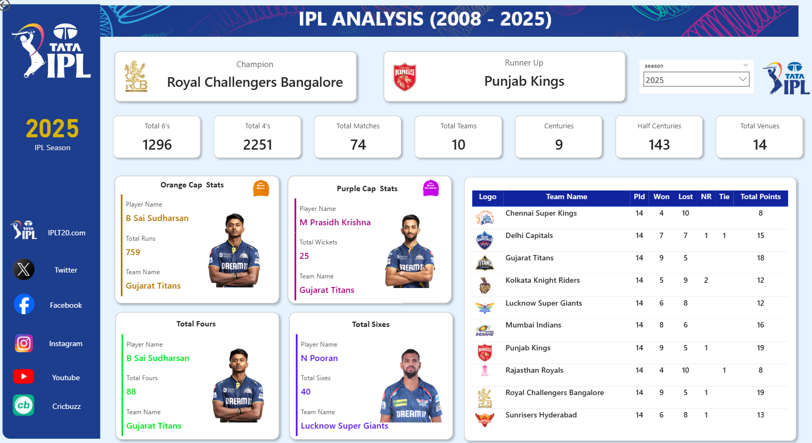

# IPL Analysis Dashboard (2008–2025) | Power BI Project

This project presents an end-to-end **Indian Premier League (IPL) analysis** using **Power BI**, covering seasons from **2008 to 2025**.  
The dashboard provides deep insights into team performance, player achievements, match statistics, and tournament trends through interactive visualizations.

The objective of this project is to demonstrate **data modeling, DAX, visualization, and analytical storytelling** skills using Power BI.

---

## 📊 Dashboard Preview

---

## 📂 Datasets Used

This project is built using **four datasets**, which were cleaned, transformed, and modeled in Power BI:

1. **ball_by_ball_data**
   - Match-wise ball-level details
   - Runs, wickets, extras, batsman, bowler information

2. **ipl_matches_data**
   - Match-level data
   - Season, venue, teams, winner, result type

3. **players_data**
   - Player details
   - Player name, role, team association

4. **teams_data**
   - Team metadata
   - Team names, abbreviations, and identifiers

---

## 🛠 Tools & Technologies

| Tool | Purpose |
|-----|--------|
| **Power BI** | Data modeling, analysis & visualization |
| **Power Query** | Data cleaning and transformation |
| **DAX** | Calculated measures and KPIs |
| **Excel / CSV** | Source data files |

---

## 🔄 Data Preparation & Modeling

- Cleaned and standardized all datasets using **Power Query**
- Established relationships between matches, players, teams, and ball-by-ball data
- Created calculated columns and measures using **DAX**
- Optimized the data model for performance and scalability

---

## 📈 Key Metrics & KPIs

- Champion & Runner-Up by Season
- Total Matches, Teams & Venues
- Total 4s and 6s
- Total Centuries & Half-Centuries
- Orange Cap (Most Runs)
- Purple Cap (Most Wickets)
- Team Points Table & Rankings
- Sales-style trend analysis adapted to sports analytics

---

## 🔍 Insights Generated

- Identified **top-performing teams and players** by season
- Analyzed **batting and bowling dominance**
- Compared **season-wise tournament trends**
- Evaluated **team consistency using points table metrics**
- Highlighted impact players through caps and boundary analysis

---

## 📦 Project Files

- `IPL_Analysis.pbix` – Power BI dashboard file  
- `ball_by_ball_data.csv` – Ball-by-ball match data  
- `ipl_matches_data.csv` – Match-level data  
- `players_data.csv` – Player information  
- `teams_data.csv` – Team information  
- `dashboard.png` – Dashboard preview image  
- `README.md` – Project documentation  

---

## 🚀 Future Enhancements

- Add **player vs player** and **team vs team** comparisons
- Integrate **predictive analytics** for match outcomes
- Build a **Power BI Service report** with scheduled refresh
- Extend analysis using **Python or SQL**

---

⭐ If you like this project, feel free to **star the repository**!
